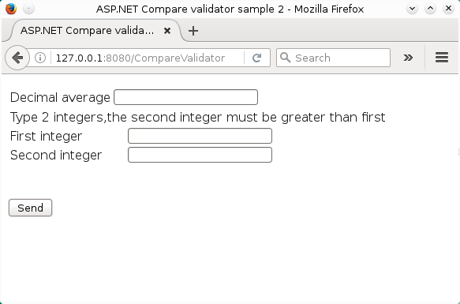
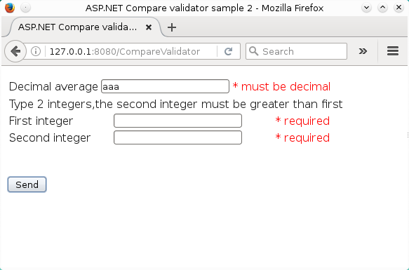
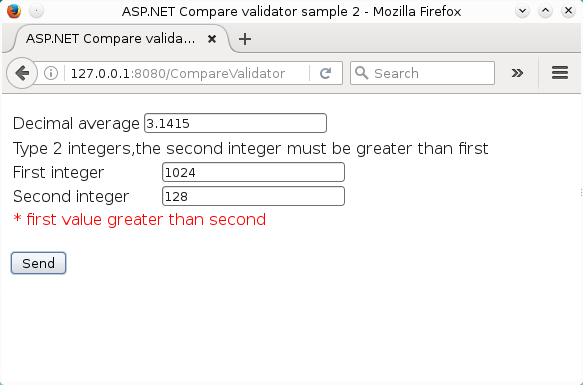

# Usando el control de validación CompareValidator ASP .NET  - parte II
		

Como un complemento al primer ejercicio del control ASP .NET CompareValidator, aqui presento un segundo ejemplo que muestra como utilizar el control <b>CompareValidator</b> para comparar el valor de un control ASP.NET con un tipo específico de dato .NET (Currency, Date, Double, Integer, String) o bien comparar si teniendo dos valores: uno es menor o mayor al otro o si ambos valores son iguales.

    

Este segundo ejemplo consta de dos archivos: <b>CompareValidatorSample2.aspx</b> y <b>CompareValidatorApp2.aspx.cs</b>

<b>Fig 1 El ejemplo muestra la comparación de un valor contra un tipo específico de dato y la comparación del valor de un control contra el valor de otro control.</b>
 

 

<b>Fig 2 Comparando el valor de un control con un tipo específico de dato .NET.</b>
 

 

<b>Fig 3 Comparando el valor de un control contra el valor de otro control.</b>
 

 

Algunas propiedades esenciales del control <b>CompareValidator.</b>
<ul>
<li><b>ControltoValidate:</b> El control de donde obtendremos el valor a comparar</li>
<li><b>ControlToCompare:</b> El control con el cual se compara el valor obtenido de la propiedad <i>ControltoValidate</i></li>
<li><b>Display:</b> Esta propiedad tiene 3 valores:
<ol>
<li><b>Static:</b> es la propiedad predeterminada, reserva un espacio suficiente en la página para mostrar el mensaje de error.</li>
<li><b>Dynamic:</b> el espacio para mostrar el mensaje no se reserva, cuando el mensaje se despliega se desplaza el contenido existente en la página.</li>
<li><b>None:</b> el mensaje no será desplegado en el lugar del control sino en el control <b>ValidatorSummary</b> si se localiza en la misma página.</li>
</ol>
</li>
<li><b>Errormessage:</b> el texto del mensaje que se desplegará si no se cumplen las condiciones.</li>
<li><b>Operator:</b> La operación que efectuará el control en los valores de los campos, los valores son los siguientes:
<ol>
<li><b>LessThan:</b>El valor del ControlToValidate debe ser menor al valor del ControlToCompare. </li>
<li><b>Equal:</b> El valor del ControlToValidate debe ser igual al valor del ControlToCompare.</li>
<li><b>NotEqual:</b> El valor del ControlToValidate no debe ser igual al valor del ControlToCompare.</li>
<li><b>LessThanEqual: </b> El valor del ControlToValidate debe ser menor o igual al valor del ControlToCompare.</li>
<li><b>GreaterThan:</b> El valor del ControlToValidate debe ser mayor  al  valor del ControlToCompare.</li>
<li><b>GreaterThanEqual: El valor del ControlToValidate debe ser mayor o igual al  valor del ControlToCompare.</b></li>
</ol>
</li>
<li><b>Type:</b> El tipo de datos de los valores a comparar, los tipos de datos disponibles para este control son:
<ol>
<li><b>Currency:</b> Moneda</li>
<li><b>Date:</b> Fecha</li>
<li><b>Double:</b> Valor de punto flotante</li>
<li><b>Integer:</b> Entero sin punto decimal</li>
<li><b>String:</b> Cadena</li>
</ol>
</li>
</ul>

